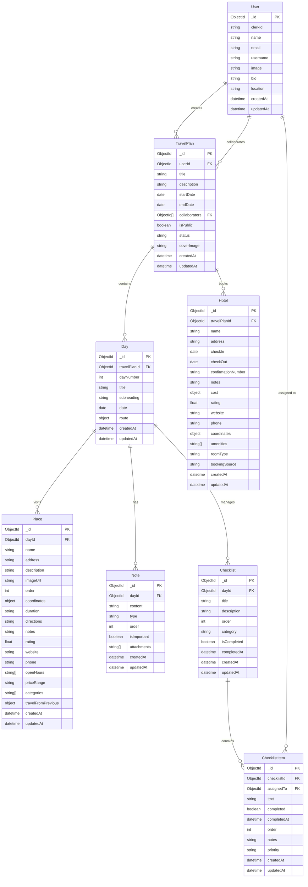

# Database Schema Changes - Travel Planner System

## Overview

Chuyển đổi từ **Embedded Documents** sang **Referenced Documents** pattern để tăng tính mở rộng và linh hoạt.

## 📊 Entity Relationship Diagram (ERD)



## 🔄 Major Changes

### 1. **Database Models - From Embedded to Referenced**

#### **Before (Embedded):**

```typescript
// Tất cả data trong 1 collection
TravelPlan {
  days: [
    {
      places: [...],
      notes: [...],
      checklists: [
        {
          items: [...]
        }
      ]
    }
  ]
}
```

#### **After (Referenced):**

```typescript
// Tách thành separate collections với references
TravelPlan → Day → Place
TravelPlan → Day → Note
TravelPlan → Day → Checklist → ChecklistItem
TravelPlan → Hotel
```

### 2. **New Database Models Created**

#### **A. Travel Plan Model**

`database/travel-plan.model.ts` - **UPDATED**

```typescript
export interface ITravelPlan {
  _id: Types.ObjectId;
  title: string;
  description?: string;
  startDate?: Date;
  endDate?: Date;
  userId: Types.ObjectId; // FK to User
  collaborators: Types.ObjectId[]; // FK to Users
  isPublic: boolean;
  status: "draft" | "active" | "completed" | "archived";
  coverImage?: string;
  createdAt: Date;
  updatedAt: Date;
}
```

#### **B. Day Model**

`database/day.model.ts` - **NEW**

```typescript
export interface IDay {
  _id: Types.ObjectId;
  travelPlanId: Types.ObjectId; // FK to TravelPlan
  dayNumber: number;
  title: string;
  subheading?: string;
  date?: Date;
  route?: {
    autoFill: boolean;
    optimize: boolean;
    duration?: string;
    distance?: string;
    totalDurationMinutes?: number;
    totalDistanceMeters?: number;
  };
  createdAt: Date;
  updatedAt: Date;
}
```

#### **C. Place Model**

`database/place.model.ts` - **NEW**

```typescript
export interface IPlace {
  _id: Types.ObjectId;
  dayId: Types.ObjectId; // FK to Day
  name: string;
  address?: string;
  description?: string;
  imageUrl?: string;
  order: number;
  coordinates?: { lat: number; lng: number };
  duration?: string;
  directions?: string;
  notes?: string;
  rating?: number;
  website?: string;
  phone?: string;
  openHours?: string[];
  priceRange?: string;
  categories?: string[];
  travelFromPrevious?: {
    // Travel info from previous place
    duration: string;
    distance: string;
    mode: "driving" | "walking" | "cycling" | "transit";
    durationMinutes: number;
    distanceMeters: number;
    provider: string;
  };
  createdAt: Date;
  updatedAt: Date;
}
```

#### **D. Note Model**

`database/note.model.ts` - **NEW**

```typescript
export interface INote {
  _id: Types.ObjectId;
  dayId: Types.ObjectId; // FK to Day
  content: string;
  type: "text" | "link" | "reminder" | "tip";
  order: number;
  isImportant: boolean;
  attachments?: string[];
  createdAt: Date;
  updatedAt: Date;
}
```

#### **E. Checklist Model**

`database/checklist.model.ts` - **UPDATED**

```typescript
export interface IChecklist {
  _id: Types.ObjectId;
  dayId: Types.ObjectId; // FK to Day
  title: string;
  description?: string;
  order: number;
  category: "packing" | "todo" | "shopping" | "documents" | "custom";
  isCompleted: boolean;
  completedAt?: Date;
  createdAt: Date;
  updatedAt: Date;
}
```

#### **F. Checklist Item Model**

`database/checklist-item.model.ts` - **NEW**

```typescript
export interface IChecklistItem {
  _id: Types.ObjectId;
  checklistId: Types.ObjectId; // FK to Checklist
  text: string;
  completed: boolean;
  completedAt?: Date;
  order: number;
  notes?: string;
  assignedTo?: Types.ObjectId; // FK to User (for collaboration)
  priority: "low" | "medium" | "high";
  createdAt: Date;
  updatedAt: Date;
}
```

#### **G. Hotel Model**

`database/hotel.model.ts` - **UPDATED**

```typescript
export interface IHotel {
  _id: Types.ObjectId;
  travelPlanId: Types.ObjectId; // FK to TravelPlan
  name: string;
  address: string;
  checkIn: Date;
  checkOut: Date;
  confirmationNumber?: string;
  notes?: string;
  cost: {
    amount: number;
    currency: string;
  };
  rating?: number;
  website?: string;
  phone?: string;
  coordinates?: { lat: number; lng: number };
  amenities?: string[];
  roomType?: string;
  bookingSource?: string;
  createdAt: Date;
  updatedAt: Date;
}
```

### 3. **Database Indexes for Performance**

```typescript
// Travel Plan
TravelPlanSchema.index({ userId: 1, status: 1 });
TravelPlanSchema.index({ collaborators: 1 });
TravelPlanSchema.index({ isPublic: 1, status: 1 });

// Day
DaySchema.index({ travelPlanId: 1, dayNumber: 1 }, { unique: true });

// Place
PlaceSchema.index({ dayId: 1, order: 1 });
PlaceSchema.index({ coordinates: "2dsphere" }); // For geo queries

// Note
NoteSchema.index({ dayId: 1, order: 1 });

// Checklist
ChecklistSchema.index({ dayId: 1, order: 1 });

// Checklist Item
ChecklistItemSchema.index({ checklistId: 1, order: 1 });

// Hotel
HotelSchema.index({ travelPlanId: 1 });
HotelSchema.index({ checkIn: 1, checkOut: 1 });
```

### 4. **Updated Validation Schemas**

`lib/validation.ts` - **UPDATED** với references

```typescript
export const TravelPlanSchema = z.object({
  title: z.string().min(1).max(200),
  description: z.string().max(1000).optional(),
  startDate: z.date().optional(),
  endDate: z.date().optional(),
  userId: z.string(),
  collaborators: z.array(z.string()).optional(),
  isPublic: z.boolean().default(false),
  status: z.enum(["draft", "active", "completed", "archived"]).default("draft"),
  coverImage: z.string().url().optional(),
});

export const DaySchema = z.object({
  travelPlanId: z.string(),
  dayNumber: z.number().min(1),
  title: z.string().min(1).max(200),
  subheading: z.string().max(500).optional(),
  date: z.date().optional(),
});

export const PlaceSchema = z.object({
  dayId: z.string(),
  name: z.string().min(1).max(200),
  address: z.string().max(500).optional(),
  description: z.string().max(2000).optional(),
  order: z.number().min(0),
  coordinates: z
    .object({
      lat: z.number(),
      lng: z.number(),
    })
    .optional(),
});

export const NoteSchema = z.object({
  dayId: z.string(),
  content: z.string().min(1).max(5000),
  type: z.enum(["text", "link", "reminder", "tip"]).default("text"),
  order: z.number().min(0),
  isImportant: z.boolean().default(false),
});

export const ChecklistSchema = z.object({
  dayId: z.string(),
  title: z.string().min(1).max(200),
  description: z.string().max(1000).optional(),
  order: z.number().min(0),
  category: z
    .enum(["packing", "todo", "shopping", "documents", "custom"])
    .default("custom"),
});

export const ChecklistItemSchema = z.object({
  checklistId: z.string(),
  text: z.string().min(1).max(500),
  completed: z.boolean().default(false),
  order: z.number().min(0),
  notes: z.string().max(1000).optional(),
  assignedTo: z.string().optional(),
  priority: z.enum(["low", "medium", "high"]).default("medium"),
});
```

## 🔗 Relationships Mapping

### **One-to-Many Relationships:**

1. **User** → **TravelPlan** (1:M)
2. **TravelPlan** → **Day** (1:M)
3. **TravelPlan** → **Hotel** (1:M)
4. **Day** → **Place** (1:M)
5. **Day** → **Note** (1:M)
6. **Day** → **Checklist** (1:M)
7. **Checklist** → **ChecklistItem** (1:M)

### **Many-to-Many Relationships:**

1. **User** ↔ **TravelPlan** (Collaborators)
2. **User** ↔ **ChecklistItem** (Assigned tasks)

## 📈 Benefits of New Design

### **✅ Advantages:**

1. **Scalability**

   - Each collection can grow independently
   - No 16MB document size limit per travel plan
   - Better memory usage

2. **Flexibility**

   - Easy to add new fields and relationships
   - Support complex queries on individual entities
   - Better data normalization

3. **Performance**

   - Can query specific data without loading everything
   - Better indexing strategies
   - Optimized for different access patterns

4. **Analytics & Reporting**

   - Easy to analyze places across all plans
   - User behavior tracking
   - Popular destinations analysis

5. **Collaboration Features**
   - Assign checklist items to users
   - Track individual contributions
   - Better permission management

### **⚠️ Considerations:**

1. **Query Complexity**

   - Need populate() or aggregation for related data
   - More complex server actions
   - Potential N+1 query issues

2. **Data Consistency**
   - Need transactions for multi-collection operations
   - More careful error handling
   - Referential integrity management

## 🚀 Next Steps Required

### **1. Create New Database Models**

- [ ] Create `database/day.model.ts`
- [ ] Create `database/place.model.ts`
- [ ] Create `database/note.model.ts`
- [ ] Update `database/checklist.model.ts`
- [ ] Create `database/checklist-item.model.ts`
- [ ] Update `database/hotel.model.ts`
- [ ] Update `database/travel-plan.model.ts`

### **2. Update Server Actions**

- [ ] Create `lib/actions/travel-plan.action.ts`
- [ ] Create `lib/actions/day.action.ts`
- [ ] Create `lib/actions/place.action.ts`
- [ ] Create `lib/actions/note.action.ts`
- [ ] Create `lib/actions/checklist.action.ts`
- [ ] Create `lib/actions/checklist-item.action.ts`
- [ ] Update `lib/actions/hotel.action.ts`

### **3. Update Components**

- [ ] Update form components for references
- [ ] Create components for new entities
- [ ] Update existing components for new schema

### **4. Data Migration (If needed)**

- [ ] Create migration script for existing embedded data
- [ ] Test migration with sample data
- [ ] Backup strategy before migration

### **5. Update Validation**

- [ ] Update `lib/validation.ts` with new schemas
- [ ] Update TypeScript interfaces
- [ ] Update API endpoints

## 🎯 Migration Strategy

### **Phase 1: Model Creation**

1. Create all new models
2. Update validation schemas
3. Test with sample data

### **Phase 2: Server Actions**

1. Implement CRUD operations
2. Handle relationships properly
3. Add error handling and transactions

### **Phase 3: Frontend Updates**

1. Update components to use new APIs
2. Handle loading states for related data
3. Optimize query patterns

### **Phase 4: Data Migration**

1. Create migration scripts
2. Test with production-like data
3. Execute migration
4. Verify data integrity

This new schema provides a solid foundation for scaling the travel planner system with better performance, flexibility, and maintainability.
