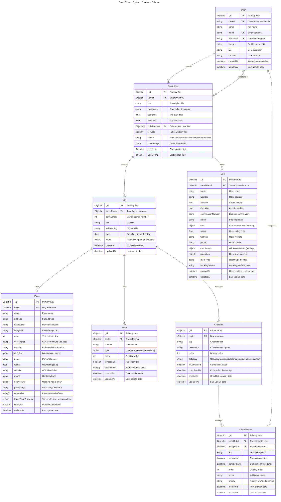

# Travel Planner System - Entity Relationship Diagram

## Database Schema Visualization

This ERD shows the complete database relationships for the travel planner system with the new referenced design pattern.



## 📊 Relationship Summary

### **One-to-Many Relationships**

1. **User** → **TravelPlan** (1:M) - A user can create multiple travel plans
2. **TravelPlan** → **Day** (1:M) - A travel plan contains multiple days
3. **TravelPlan** → **Hotel** (1:M) - A travel plan can have multiple hotel bookings
4. **Day** → **Place** (1:M) - A day can have multiple places to visit
5. **Day** → **Note** (1:M) - A day can have multiple notes
6. **Day** → **Checklist** (1:M) - A day can have multiple checklists
7. **Checklist** → **ChecklistItem** (1:M) - A checklist contains multiple items

### **Many-to-Many Relationships**

1. **User** ↔ **TravelPlan** (M:M) - Users can collaborate on travel plans
2. **User** ↔ **ChecklistItem** (M:M) - Users can be assigned to checklist items

## 🔑 Key Design Decisions

### **Primary Keys**

- All entities use MongoDB ObjectId as primary key (`_id`)
- Ensures unique identification across collections
- Enables efficient indexing and relationships

### **Foreign Keys**

- Referenced using ObjectId fields with FK notation
- Enables proper data normalization and relationships
- Supports efficient queries and joins

### **Indexes (Recommended)**

```javascript
// Travel Plan Collection
db.travelplans.createIndex({ userId: 1, status: 1 });
db.travelplans.createIndex({ collaborators: 1 });
db.travelplans.createIndex({ isPublic: 1, status: 1 });

// Day Collection
db.days.createIndex({ travelPlanId: 1, dayNumber: 1 }, { unique: true });

// Place Collection
db.places.createIndex({ dayId: 1, order: 1 });
db.places.createIndex({ coordinates: "2dsphere" }); // Geospatial queries

// Note Collection
db.notes.createIndex({ dayId: 1, order: 1 });

// Checklist Collection
db.checklists.createIndex({ dayId: 1, order: 1 });

// ChecklistItem Collection
db.checklistitems.createIndex({ checklistId: 1, order: 1 });
db.checklistitems.createIndex({ assignedTo: 1 });

// Hotel Collection
db.hotels.createIndex({ travelPlanId: 1 });
db.hotels.createIndex({ checkIn: 1, checkOut: 1 });
```

## 🎯 Benefits of This Schema Design

### **Scalability**

- No MongoDB 16MB document size limit
- Each collection can grow independently
- Better memory utilization

### **Performance**

- Targeted queries for specific entities
- Efficient indexing strategies
- Optimized for different access patterns

### **Flexibility**

- Easy to add new entity types
- Support for complex relationships
- Extensible for future features

### **Data Integrity**

- Proper foreign key relationships
- Referential integrity through validation
- Consistent data structure

### **Collaboration Features**

- User assignment to checklist items
- Multiple collaborators per travel plan
- Granular permission control potential

## 🚀 Implementation Notes

### **Query Patterns**

```javascript
// Get complete travel plan with all related data
const travelPlan = await TravelPlan.findById(id)
  .populate({
    path: "days",
    populate: [
      { path: "places", options: { sort: { order: 1 } } },
      { path: "notes", options: { sort: { order: 1 } } },
      {
        path: "checklists",
        populate: {
          path: "items",
          options: { sort: { order: 1 } },
          populate: { path: "assignedTo", select: "name email" },
        },
      },
    ],
  })
  .populate("hotels")
  .populate("collaborators", "name email image");
```

### **Transaction Support**

```javascript
// Multi-collection operations with transactions
const session = await mongoose.startSession();
await session.withTransaction(async () => {
  const travelPlan = await TravelPlan.create([newPlan], { session });
  const day = await Day.create(
    [{ ...newDay, travelPlanId: travelPlan[0]._id }],
    { session }
  );
  await Place.create([{ ...newPlace, dayId: day[0]._id }], { session });
});
```

This ERD provides a comprehensive view of the travel planner system's data architecture, supporting complex travel planning workflows with proper scalability and data integrity.
