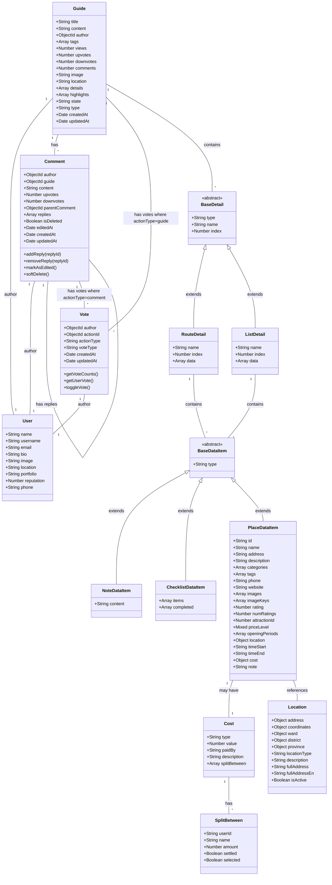

# Guide System Class Diagram

## Class Descriptions

### Core Classes

#### Guide

- Central entity representing a travel guide
- Contains details about places, routes, and other information
- Can receive comments and votes

#### User

- Represents a user in the system
- Can be an author of guides and comments, or cast votes

#### Comment

- Represents a comment on a guide
- Can have nested replies
- Can receive upvotes and downvotes

#### Vote

- Represents a vote (upvote or downvote) on a guide or comment
- Links the voter (author) with the voted content

### Detail Structure

#### BaseDetail

- Abstract class for details within a guide
- Two concrete types: RouteDetail and ListDetail

#### RouteDetail

- Represents a route/itinerary for a specific part of the guide
- Contains various data items (places, notes, checklists)

#### ListDetail

- Represents a list of items (not route-based)
- Contains various data items like RouteDetail

### Data Items

#### BaseDataItem

- Abstract class for items within details
- Three concrete types: NoteDataItem, ChecklistDataItem, PlaceDataItem

#### NoteDataItem

- Simple text note item

#### ChecklistDataItem

- List of items that can be checked off

#### PlaceDataItem

- Detailed information about a place to visit
- Includes location, cost, timing information

### Supporting Classes

#### Cost

- Cost information that can be attached to PlaceDataItem
- Includes expense splitting functionality

#### SplitBetween

- Information about how costs are split among users

#### Location

- Detailed location information with administrative divisions

## Key Relationships

1. **Guide-User**: Each guide is authored by one user
2. **Guide-Comment**: A guide can have many comments
3. **Guide-Vote**: Users can upvote or downvote guides
4. **Guide-Detail**: A guide contains multiple details (routes or lists)
5. **Comment-User**: Each comment is authored by one user
6. **Comment-Comment**: Comments can have nested replies (parent-child relationship)
7. **Comment-Vote**: Comments can be upvoted or downvoted
8. **Detail-DataItem**: Details contain data items (notes, checklists, places)
