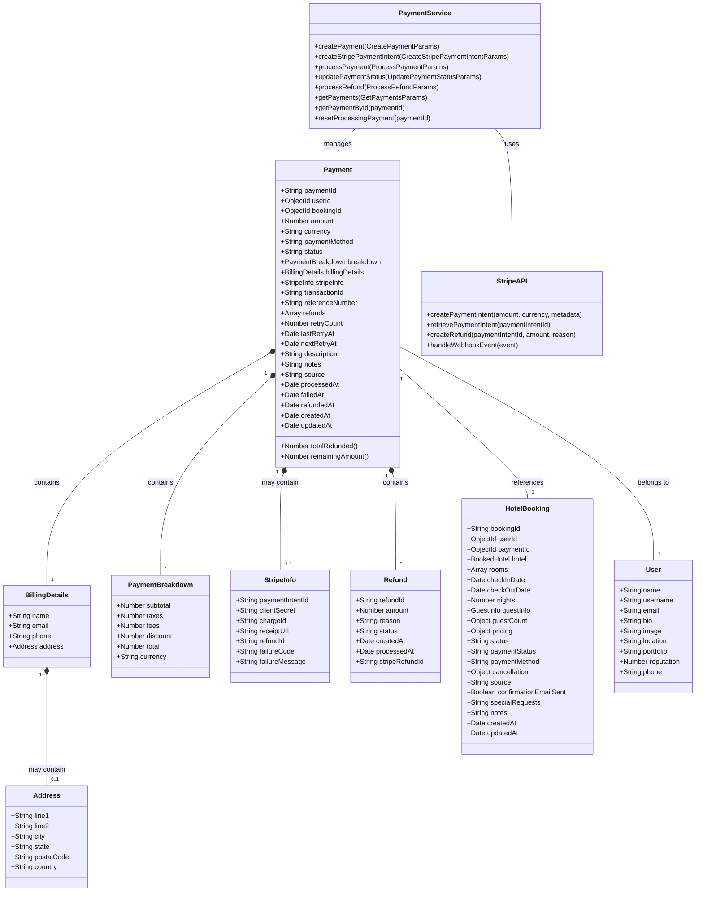

# Payment System Class Diagram

## Class Descriptions

### Core Payment Classes

#### Payment

- Central entity for payment information
- Tracks payment status, amount, and associated references
- Contains methods to calculate refund amounts

#### BillingDetails

- Contact information for the person making the payment
- Contains name, email, phone, and possibly an address

#### PaymentBreakdown

- Detailed breakdown of payment amounts
- Shows subtotal, taxes, fees, discounts, and total

#### StripeInfo

- Stripe-specific payment information
- Contains references to Stripe resources like paymentIntentId

#### Refund

- Information about a refund processed for a payment
- Tracks refund amount, reason, status, and Stripe reference

### Related Entities

#### HotelBooking

- The booking that is being paid for
- References the payment and contains booking details

#### User

- The user who made the payment
- Contains basic user information

### Service Classes

#### PaymentService

- Handles all payment-related operations
- Creates payments, processes transactions, handles refunds

#### StripeAPI

- Interface to the Stripe payment processor
- Creates payment intents, processes refunds, handles webhooks

## Key Relationships

1. **Payment-User**: Each payment is made by one user
2. **Payment-HotelBooking**: Each payment is associated with one booking
3. **Payment-PaymentBreakdown**: Each payment contains a breakdown of amounts
4. **Payment-BillingDetails**: Each payment includes billing information
5. **Payment-StripeInfo**: Payments may contain Stripe-specific information
6. **Payment-Refund**: A payment may have multiple refunds
7. **PaymentService-Payment**: The service manages payment entities
8. **PaymentService-StripeAPI**: The payment service uses Stripe for processing

## Payment Statuses

1. **pending**: Payment has been created but not processed
2. **processing**: Payment is being processed
3. **succeeded**: Payment has been successfully completed
4. **failed**: Payment processing failed
5. **cancelled**: Payment was cancelled
6. **refunded**: Payment has been fully refunded
7. **partially_refunded**: Payment has been partially refunded

## Refund Statuses

1. **pending**: Refund has been requested but not processed
2. **succeeded**: Refund has been successfully processed
3. **failed**: Refund processing failed
