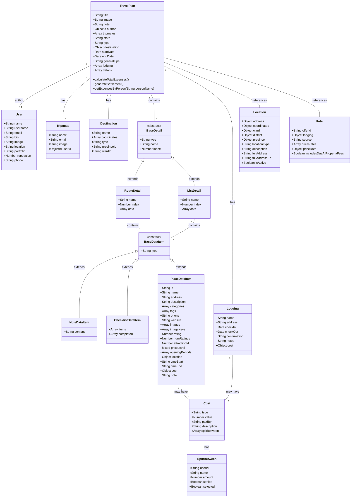

# Planner System Class Diagram

## Class Descriptions

### Core Classes

#### TravelPlan

- Central entity that represents a travel plan/itinerary
- Contains all information about a trip including destinations, lodging, details
- Has methods for expense calculations and settlements

#### User

- Represents a user in the system
- Can be an author of a travel plan or a tripmate

#### Tripmate

- Represents a participant in the travel plan
- Can be linked to a User or just have basic information

### Detail Structure

#### BaseDetail

- Abstract class for details within a travel plan
- Two concrete types: RouteDetail and ListDetail

#### RouteDetail

- Represents a route/itinerary for a specific day
- Contains various data items (places, notes, checklists)

#### ListDetail

- Represents a list of items (not route-based)
- Contains various data items like RouteDetail

### Data Items

#### BaseDataItem

- Abstract class for items within details
- Three concrete types: NoteDataItem, ChecklistDataItem, PlaceDataItem

#### NoteDataItem

- Simple text note item

#### ChecklistDataItem

- List of items that can be checked off

#### PlaceDataItem

- Detailed information about a place to visit
- Includes location, cost, timing information

### Supporting Classes

#### Lodging

- Accommodation information
- Includes check-in/check-out dates, costs

#### Cost

- Cost information that can be attached to Lodging or PlaceDataItem
- Includes expense splitting functionality

#### SplitBetween

- Information about how costs are split among tripmates

#### Destination

- Main destination information for the travel plan

#### Location

- Detailed location information with administrative divisions

#### Hotel

- Detailed hotel information from external API integration
